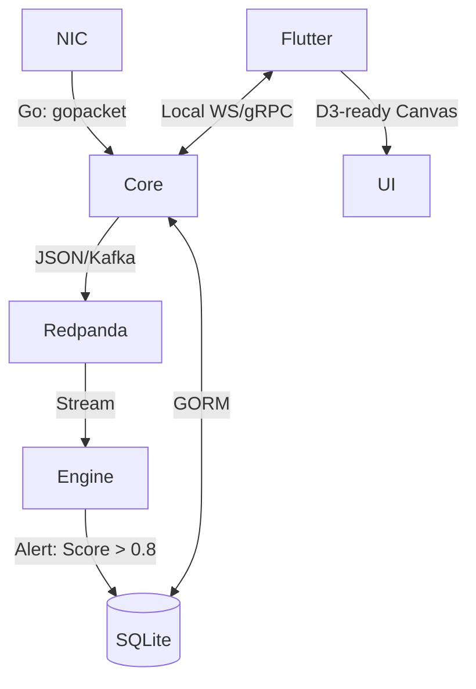

# NetLyra PRD (Hard Facts)

## 1. Stack

- **Core Engine**: Go (gopacket, Gin, GORM) | **Role**: Ingestion, DB SSOT, Orchestrator.
- **AI Engine**: Python (River) | **Role**: Streaming Anomaly Detection.
- **Interface**: Flutter Web | **Role**: Reactive Web HUD.
- **Messaging**: Redpanda | **Role**: High-throughput Event Log.
- **Storage**: SQLite | **Controller**: Go GORM logic.

## 2. Data Flow

## 3. Specs

- **Ingestion**: 1Gbps+ stable capture (libpcap/af_packet).
- **UI Render**: 60Hz target, browser canvas rendering.
- **Latency**: End-to-end processing < 80ms.
- **Rendering**: Deterministic Asset Bundling (Fonts/Icons embedded in binary).
- **Precision**: 50-packet warmup for AI drift detection.

## 4. Logic

### 4.1 NetLyra Core (Go)

- **L2-L4 Decoder**: Raw packet slicing to 5-tuple metrics.
- **DB SSOT**: GORM `Alert` Model as the unique truth source.
- **API**: High-concurrency Gin server (REST + WebSocket).

### 4.2 AI Engine (Python)

- **Features**: Incremental Feature Extraction (Entropy/Density).
- **Model**: HalfSpaceTrees (Hoeffding Tree derivative).

### 4.3 UI Portal (Flutter)

- **Theme**: Cyberpunk Industrial (Dark OLED).
- **Visuals**: Neon Glow effects, Scanline overlays, Glitch transitions on Alert.
- **Charts**:
  - **Streaming Area Chart**: Real-time packet velocity (Neon Blue).
  - **Force-Directed Graph**: IP-to-IP relationships (Dynamic Nodes).
  - **Confidence Ribbon**: Anomaly score + variance prediction.

## 5. UI/UX Pro Max Design System

- **Style**: Cyberpunk HUD / Industrial Terminal.
- **Color Palette**:
  - **Background**: #020617 (Deep Abyss).
  - **Primary/Action**: #22C55E (Terminal Green).
  - **Warning/Critical**: #EF4444 (Emergency Red).
  - **Accent**: #38BDF8 (Digital Cyan).
- **Typography**:
  - **Primary Sans (Global/CJK)**: 'Noto Sans SC' (Google Fonts).
  - **Headings (Latin/Technical)**: 'Orbitron' (Google Fonts).
  - **Data/Terminal**: 'Share Tech Mono' (Google Fonts).
- **Key Effects**:
  - **Minimal Glow**: text-shadow 0 0 8px mapped to signal strength.
  - **Micro-Glass**: 3% opacity frosted blur solely for non-scrolling overlays (e.g., Modals/Side-panels).
  - **High-Density Bento**: Information-dense modular widgets with hard-bevel borders.
  - **Micro-animations**: 150ms spring transitions for dashboard tiles.
- **Constraints**:
  - **Performance First**: Mass Glassmorphism (>20% screen area) strictly prohibited to maintain 60Hz chart performance.

## 6. Legal & Licensing

- **Fonts**: All fonts (Orbitron, Noto Sans SC, Share Tech Mono) are loaded via `google_fonts` under the SIL Open Font License 1.1.
- **Software License**: GNU Affero General Public License (AGPL) v3.
- **Compliance**: No restricted proprietary dependencies.

## 7. Standards

- **Unified Launch**: `Taskfile.yml` orchestrated sequence.
- **Standalone**: Multi-arch Binary (Go) + Flutter Web bundle.
- **Testing**: Bruno API Collection (100% Coverage).

---
