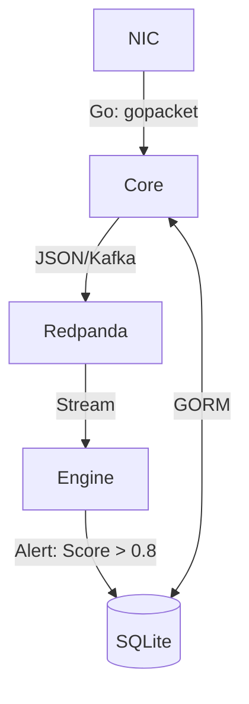

# NetLyra PRD (Hard Facts)

### 1. Stack

- **Core Engine**: Go (gopacket, Gin, GORM) | **Role**: Ingestion, DB SSOT, Orchestrator.
- **AI Engine**: Python (River) | **Role**: Streaming Anomaly Detection.
- **Messaging**: Redpanda | **Role**: High-throughput Event Log.
- **Storage**: SQLite | **Controller**: Go GORM logic.

## 2. Data Flow

```mermaid
graph TD
    NIC -->|Go: gopacket| Core
    Core -->|JSON/Kafka| Redpanda
    Redpanda -->|Stream| Engine
    Engine -->|Alert: Score > 0.8| DB[(SQLite)]
    Core <-->|GORM| DB
```

## 3. Specs

- **Ingestion**: 1Gbps+ stable capture (libpcap/af_packet).
- **Latency**: End-to-end processing < 80ms.
- **Precision**: 50-packet warmup for AI drift detection.

## 4. Logic

### 4.1 NetLyra Core (Go)

- **L2-L4 Decoder**: Raw packet slicing to 5-tuple metrics.
- **DB SSOT**: GORM `Alert` Model as the unique truth source.
- **API**: High-concurrency Gin server (REST + WebSocket).

### 4.2 AI Engine (Python)

- **Features**: Incremental Feature Extraction (Entropy/Density).
- **Model**: HalfSpaceTrees (Hoeffding Tree derivative).

## 5. Legal & Licensing

- **Software License**: GNU Affero General Public License (AGPL) v3.
- **Compliance**: No restricted proprietary dependencies.

## 6. Standards

- **Unified Launch**: `Taskfile.yml` orchestrated sequence.
- **Testing**: Go native `httptest` (100% Coverage).

---
