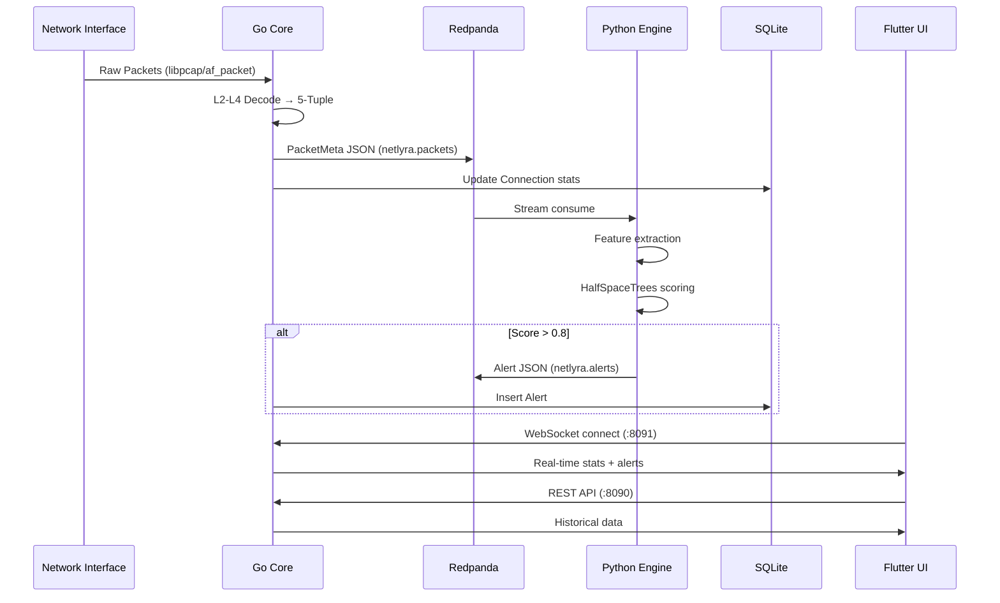

# NetLyra Architecture

## Data Flow



## Component Interfaces

### Redpanda Topics

| Topic             | Producer      | Consumer      | Schema     |
| ----------------- | ------------- | ------------- | ---------- |
| `netlyra.packets` | Go Core       | Python Engine | PacketMeta |
| `netlyra.alerts`  | Python Engine | Go Core       | Alert      |

### PacketMeta Schema (JSON)

```json
{
  "ts": "2026-01-29T12:00:00Z",
  "src_ip": "192.168.1.100",
  "dst_ip": "8.8.8.8",
  "src_port": 54321,
  "dst_port": 443,
  "proto": "TCP",
  "payload_len": 1420,
  "tcp_flags": "ACK,PSH",
  "entropy": 7.82
}
```

### Alert Schema (JSON)

```json
{
  "ts": "2026-01-29T12:00:01Z",
  "src_ip": "192.168.1.100",
  "dst_ip": "8.8.8.8",
  "src_port": 54321,
  "dst_port": 443,
  "proto": "TCP",
  "score": 0.92,
  "features": {
    "entropy": 7.82,
    "packet_rate": 1500,
    "byte_rate": 2100000
  }
}
```

### REST API Endpoints

| Method | Path                  | Description             |
| ------ | --------------------- | ----------------------- |
| GET    | `/api/v1/health`      | Health check            |
| GET    | `/api/v1/alerts`      | List alerts (paginated) |
| GET    | `/api/v1/alerts/:id`  | Get alert detail        |
| GET    | `/api/v1/connections` | List active connections |
| GET    | `/api/v1/stats`       | Real-time statistics    |

### WebSocket Events

| Event        | Direction       | Payload                        |
| ------------ | --------------- | ------------------------------ |
| `stats`      | Server → Client | Real-time packet/byte counters |
| `alert`      | Server → Client | New alert notification         |
| `connection` | Server → Client | Connection state change        |

## Directory Layout

```
./
├── cmd/netlyra/           # Go entrypoint
│   └── main.go
├── internal/
│   ├── models/            # GORM Schema (SSOT)
│   ├── capture/           # gopacket packet capture
│   ├── api/               # Gin REST + WebSocket
│   └── producer/          # Redpanda producer
├── engine/                # Python AI
│   ├── src/engine/
│   │   ├── consumer.py    # Kafka consumer
│   │   ├── model.py       # HalfSpaceTrees
│   │   └── main.py        # Entry point
│   └── pyproject.toml
├── ui/                    # Flutter Web
├── bruno/                 # API test collection
├── memory/                # State machine files
├── docs/                  # Architecture docs
├── data/                  # SQLite DB (gitignored)
├── Taskfile.yml           # Unified commands
└── .env.example           # Config template
```

## Performance Targets

| Metric      | Target     | Measurement        |
| ----------- | ---------- | ------------------ |
| Ingestion   | 1 Gbps     | libpcap/af_packet  |
| E2E Latency | < 80ms     | Packet → UI update |
| UI Render   | 60 Hz      | Browser canvas     |
| AI Warmup   | 50 packets | Pre-detection      |
